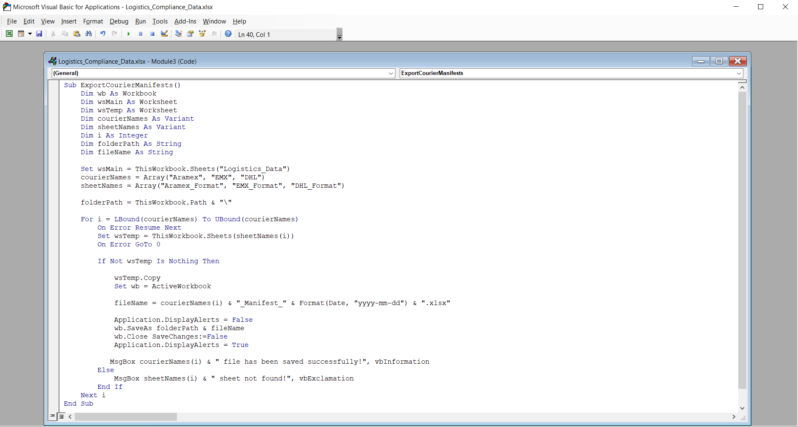
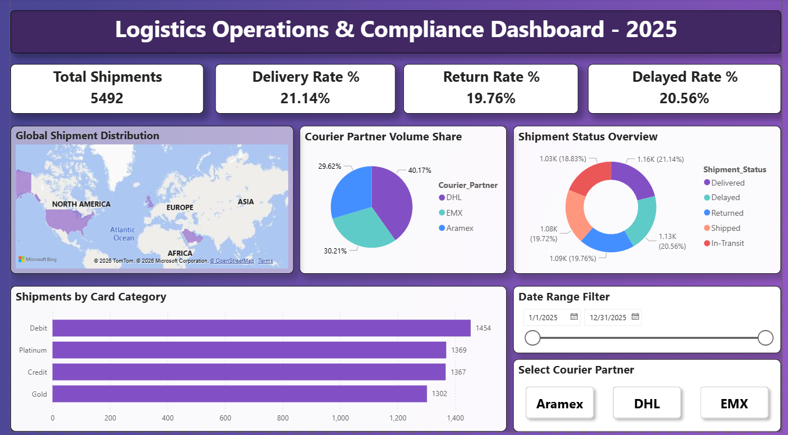

# Automated Logistics Data Consolidator & Analytics 🚀

### 📄 Project Overview
This project was developed to automate the complex process of consolidating, categorizing, and analyzing data from multiple courier partners (e.g., Aramex, DHL, EMX). By replacing manual workflows with a robust automated pipeline, this tool minimizes human error and provides real-time, audit-ready reporting.

### 🛡️ Security & Compliance Disclaimer
> **Note:** All data, names, and contact details used in this repository are **simulated/dummy data** created for demonstration purposes. This project adheres to strict **Data Privacy and Security Compliance** standards; no real client or proprietary financial data from previous employers has been used in this documentation or source code.

---

### 🛠 Technical Stack
*   **Excel Power Query:** Used for ETL (Extract, Transform, Load) processes, data cleaning, and merging disparate data sources.
*   **VBA (Macros):** Automates the final distribution logic, splitting consolidated data into partner-specific manifests with a single click.
*   **Power BI & DAX:** Used to build interactive dashboards that track Delivery KPIs, Lead Times, and Partner Performance.

### ✨ Key Features
*   **One-Click Automation:** Instantly generates separate, formatted files for different courier partners.
*   **Automated Data Mapping:** Power Query ensures that incoming data is always mapped to the correct headers regardless of the source format.
*   **Scalable Architecture:** Designed to process thousands of rows efficiently without performance degradation.
*   **Data Integrity & Validation:** Built-in checks to ensure data consistency, meeting the high accuracy standards required in the banking and fintech sectors.

---

### 💻 VBA Automation Logic

*This script automates the distribution of consolidated data into partner-specific Excel manifests.*

### 📂 Repository Structure
*   `📁 Source_Code`: Contains the VBA modules and Power Query M-code snippets.
*   `📁 Templates`: Sanitized Excel Master files and Power BI Template (`.pbix`) files.
*   `📁 Sample_Outputs`: Examples of generated reports (e.g., *Aramex_Manifest_2026-05-03.xlsx*).
*   `README.md`: Project documentation and setup guide.

---

### 📊 Business Impact
*   **Efficiency:** Reduces data handling and reporting time by approximately **90%**.
*   **Accuracy:** Eliminates manual copy-paste errors, ensuring **100% data reliability**.
*   **Strategic Insights:** Enables management to make data-driven decisions by comparing courier performance in real-time.

---

### 🚀 How to Use
1.  Open the `Master_File.xlsm`.
2.  Paste your raw data into the **'Input'** sheet.
3.  Click the **'Process & Split Data'** button.
4.  The system will automatically generate and save individual files for each partner in your local directory.

---

### 🖼️ Dashboard Preview
 

---

---

### 👨‍💻 Connect with Me
I am passionate about building automated systems that bridge the gap between complex operations and data-driven insights. If you are interested in **Data Automation, MIS Analyst, Logistics Analytics, or FinTech solutions**, let’s connect!

[**LinkedIn Profile**](www.linkedin.com/in/inam-hasan) | 
